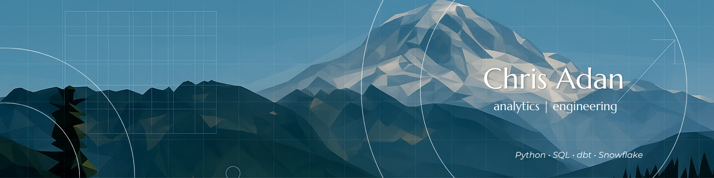

  

# 👋 I'm Chris - Nice to meet you

**Analytics Engineer | Data Architect | Solution Designer**

Welcome to my GitHub — I build pipelines, models, and insights that bridge raw data to real-world decisions.

---

## 🔍 **About Me**

I'm an analytics engineer with a passion for elegant data solutions, clean architecture, and meaningful storytelling. My work blends robust engineering with clear, actionable insights — helping teams move from **data** to **impact**.

I love working at the intersection of:
- **Data Engineering:** pipelines, orchestration, cloud architecture.
- **Analytics Engineering:** dbt, Snowflake, Python, PostgreSQL.
- **Visualization & Insights:** EDA, dashboards, storytelling.

---

## 🚀 **Key Projects**

Here's a snapshot of what I'm building:

| Project | Description | Domain | Tech |
| ------- | ----------- | ------ | ---- |
| [**Sonder**](https://github.com/ChrisAdan/sonder) | Modern analytics engineering framework with elegant data transformations and automated insights |    |     |
| [**Earth**](https://github.com/ChrisAdan/earth) | Geospatial analytics pipeline for environmental data processing and climate insights |    |     |
| [**Leap**](https://github.com/ChrisAdan/leap) | High-performance data transformation engine with advanced ML pipeline capabilities |    |     |
| [**Patient Risk Simulation**](https://github.com/ChrisAdan/fhir) | Full stack healthcare analytics pipeline using FHIR, Snowflake, dbt, and ML features |    |    |
| [**PokéML**](https://github.com/ChrisAdan/pokemon) | Analytics and ML pipeline using open Pokémon training data |   |     |
| [**ShiftStats**](https://github.com/ChrisAdan/shiftstats) | Quick-turn analytics project demonstrating ETL and insight generation techniques |    |      |
| [**WeatherStats**](https://github.com/ChrisAdan/weather_stats) | A TDD-driven pipeline to ingest & analyze 50K+ weather CSVs |    |    |

---

## 🤝 **Let's Connect**

  

I'm always up for chatting about data architecture, open-source pipelines, or any interesting project.

Thanks for stopping by — feel free to ⭐️ any repo that inspires you!

---

  

